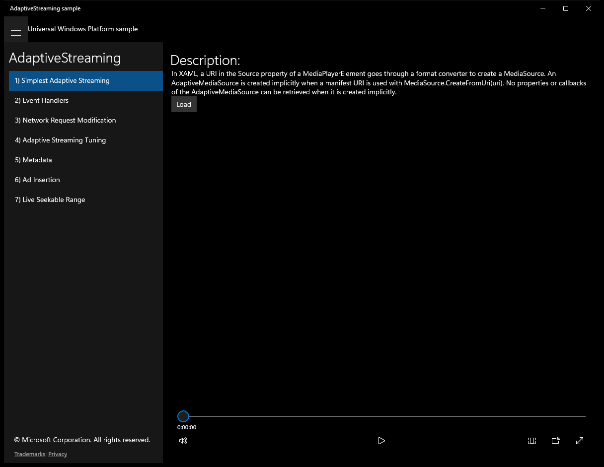
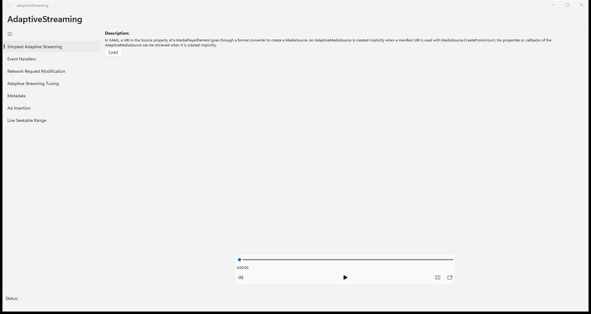
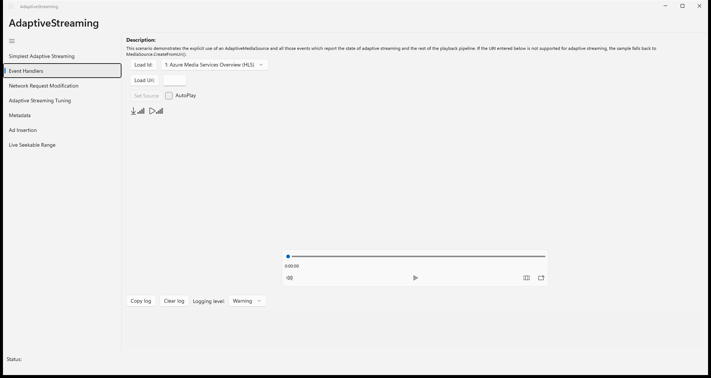
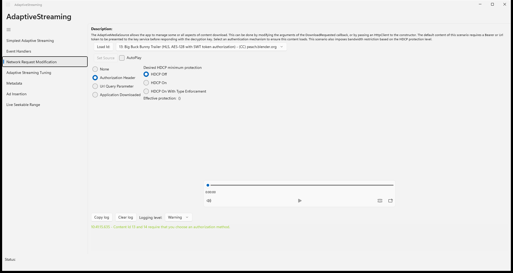
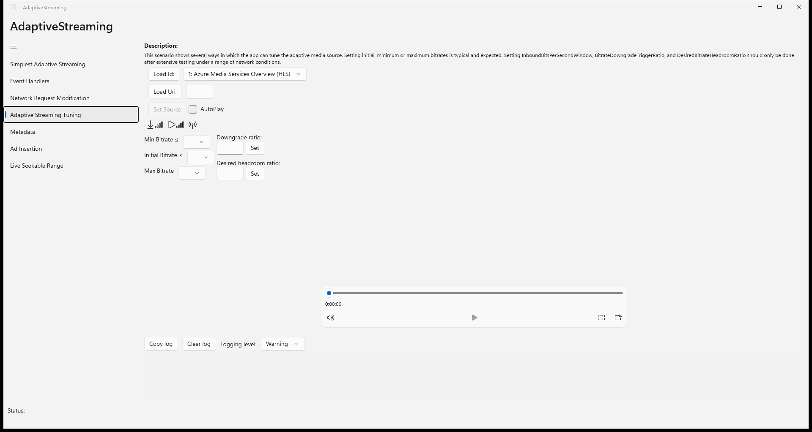
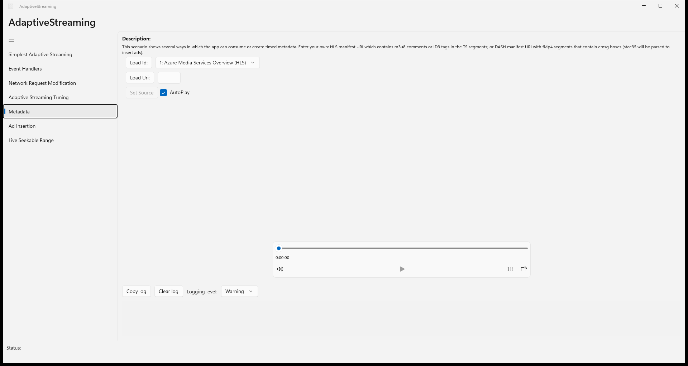
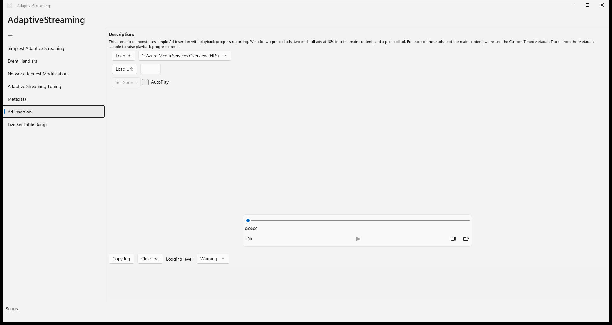
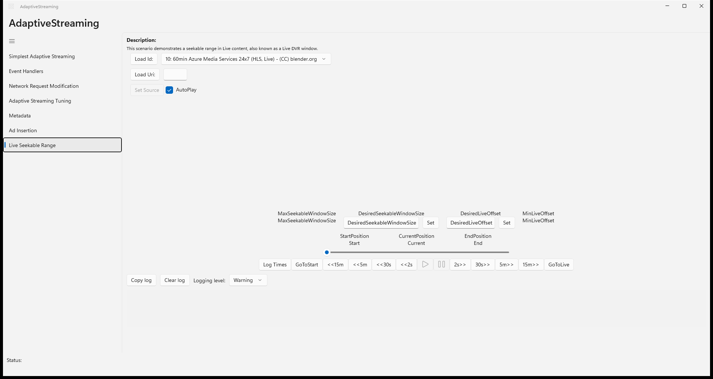

# AdaptiveStreaming — WinUI 3 (migrated from UWP)

**Quality: 94 / 100**

| Project | UI fidelity | Visual fidelity | Functional fidelity |
|:-:|:-:|:-:|:-:|
| 9 / 10 | 9 / 10 | 8 / 10 | 8 / 10 |

HLS/DASH adaptive bitrate streaming, custom HTTP headers, live seekable range, ad insertion.

## Run

```powershell
cd AdaptiveStreaming && winapp run
```

## Before / after (main view)

UWP source (baseline) and the WinUI 3 migration of the same scenario:

| UWP source | WinUI 3 (this migration) |
|:-:|:-:|
|  |  |

<!-- BEGIN per-scenario -->
## Per-scenario WinUI 3 output

Each scenario page from the migrated WinUI 3 build:

|  |  |
|:-:|:-:|
| **Scenario 1 — Simplest Adaptive Streaming**<br/> | **Scenario 2 — Event Handlers**<br/> |
| **Scenario 3 — Network Request Modification**<br/> | **Scenario 4 — Adaptive Streaming Tuning**<br/> |
| **Scenario 5 — Metadata**<br/> | **Scenario 6 — Ad Insertion**<br/> |
| **Scenario 7 — Live Seekable Range**<br/> |  |

<!-- END per-scenario -->

## Source

- UWP source: `..\..\..\uwp-samples-standalone\Samples\AdaptiveStreaming\cs\`
- Migrated by: Claude Opus 4.6 + the `winui-uwp-migration` skill
- Project file: `AdaptiveStreaming\AdaptiveStreaming.csproj`

