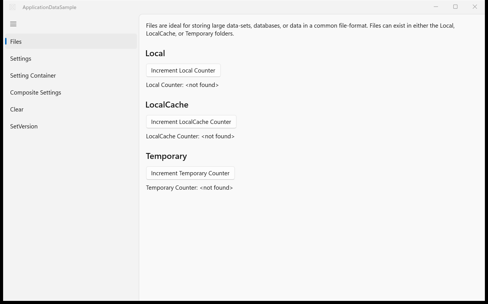
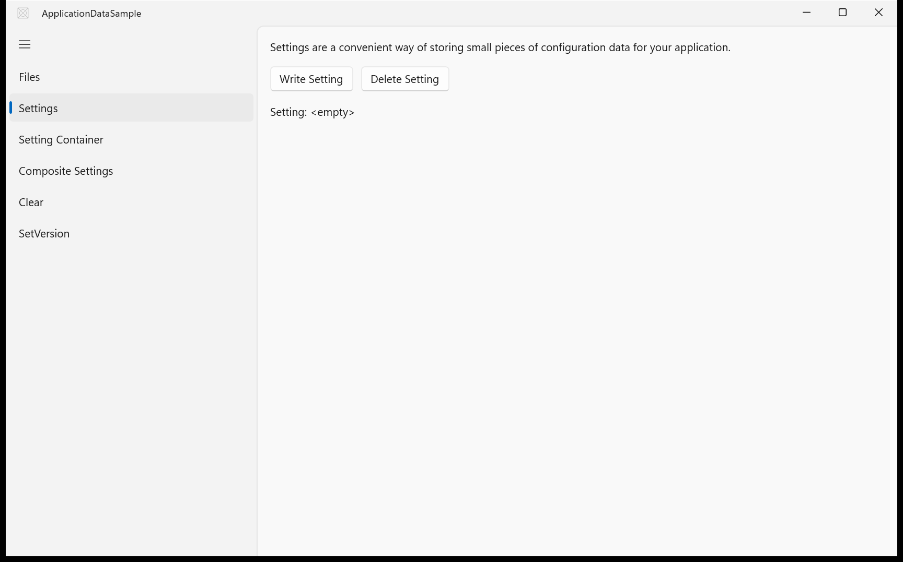
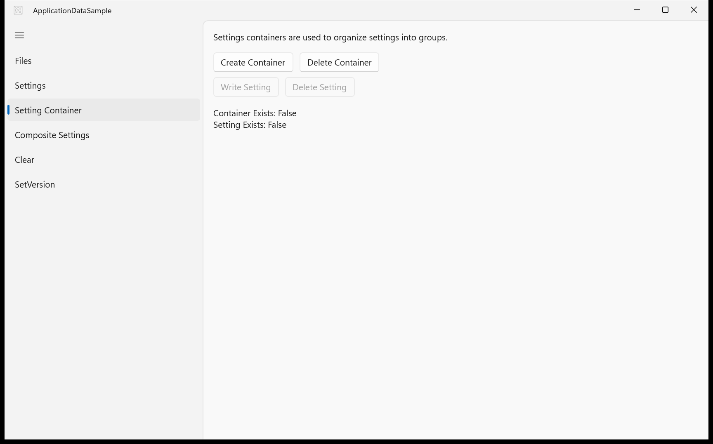
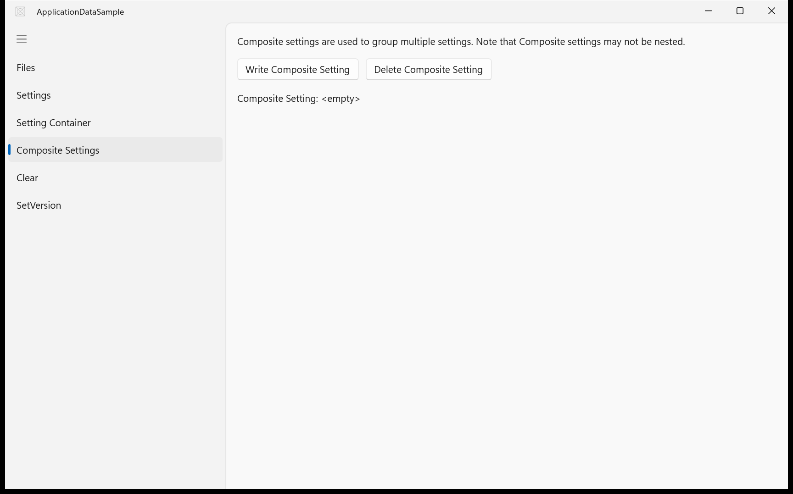
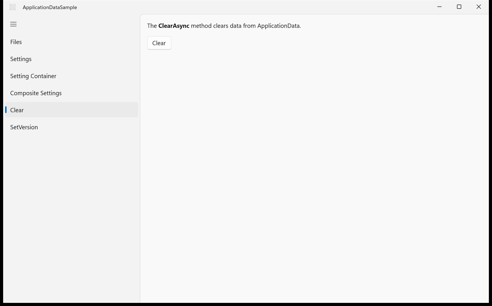
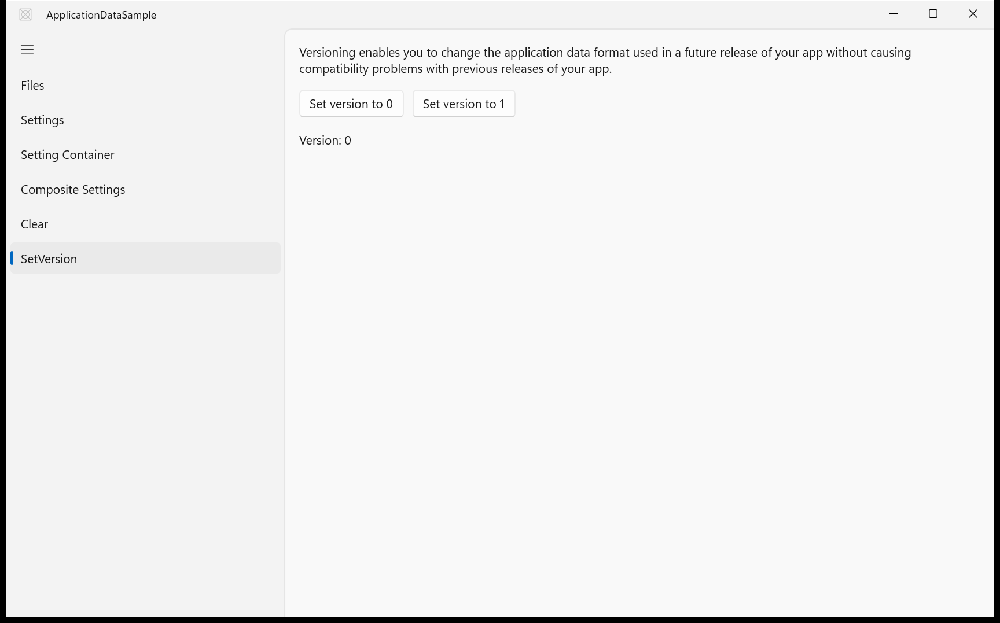

# ApplicationData — WinUI 3 (migrated from UWP)

**Quality: 92 / 100**

| Project | UI fidelity | Visual fidelity | Functional fidelity |
|:-:|:-:|:-:|:-:|
| 9 / 10 | 9 / 10 | 8 / 10 | 10 / 10 |

Local / roaming / temp data folders, settings persistence, composite settings, versioned schemas.

## Run

```powershell
winapp run
```

## Before / after (main view)

UWP source (baseline) and the WinUI 3 migration of the same scenario:

| UWP source | WinUI 3 (this migration) |
|:-:|:-:|
|  |  |

<!-- BEGIN per-scenario -->
## Per-scenario WinUI 3 output

Each scenario page from the migrated WinUI 3 build:

|  |  |
|:-:|:-:|
| **Scenario 1 — Scenario1 Files**<br/> | **Scenario 2 — Scenario2 Settings**<br/> |
| **Scenario 3 — Scenario3 SettingContainer**<br/> | **Scenario 4 — Scenario4 CompositeSettings**<br/> |
| **Scenario 6 — Clear**<br/> | **Scenario 7 — SetVersion**<br/> |

<!-- END per-scenario -->

## Source

- UWP source: `..\..\..\uwp-samples-standalone\Samples\ApplicationData\cs\`
- Migrated by: Claude Opus 4.6 + the `winui-uwp-migration` skill (run16)
- Project file: `ApplicationDataSample\ApplicationDataSample.csproj`
