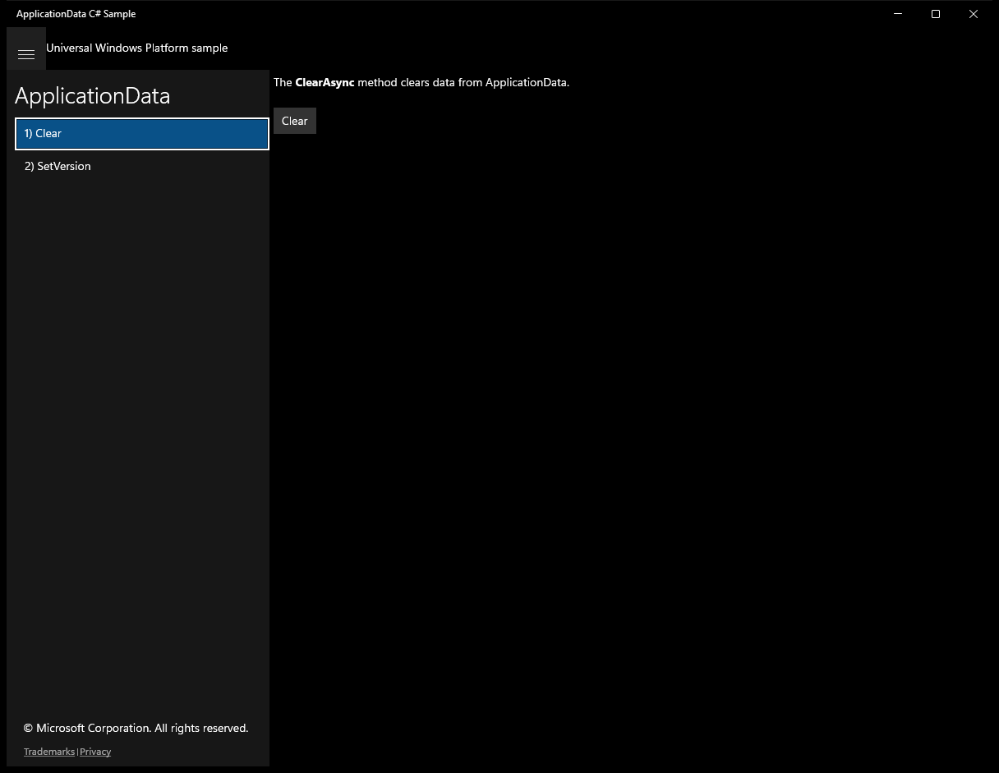
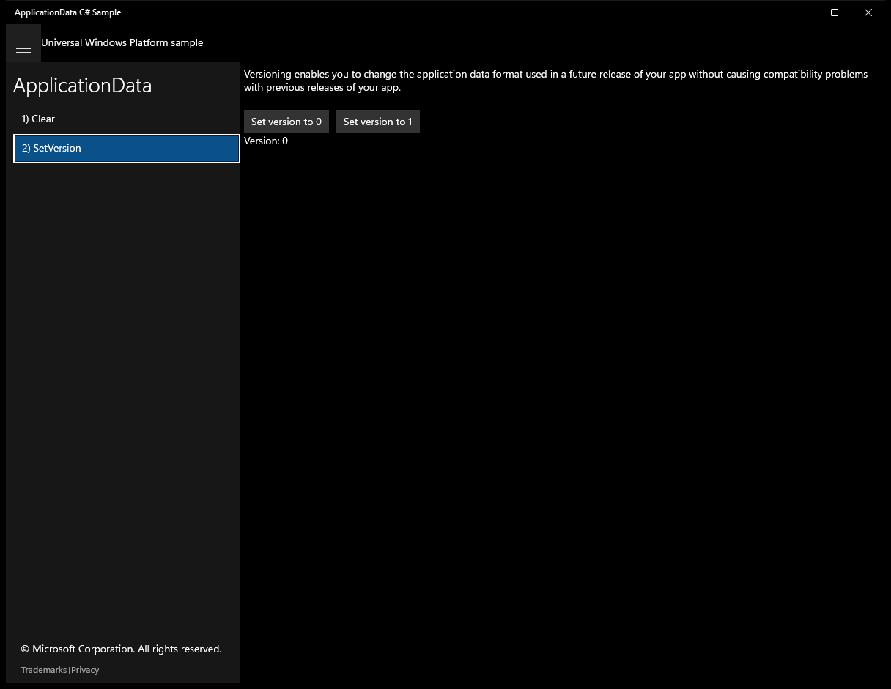

# ApplicationData — WinUI 3 (migrated from UWP)

**Quality: 92 / 100**

| Project | UI fidelity | Visual fidelity | Functional fidelity |
|:-:|:-:|:-:|:-:|
| 9 / 10 | 9 / 10 | 8 / 10 | 10 / 10 |

Local / roaming / temp data folders, settings persistence, composite settings, versioned schemas.

## Run

```powershell
winapp run
```

## Before / after (main view)

UWP source (baseline) and the WinUI 3 migration of the same scenario:

| UWP source | WinUI 3 (this migration) |
|:-:|:-:|
|  |  |

<!-- BEGIN per-scenario -->
## Per-scenario UWP -> WinUI 3 comparison

Initial state of each scenario page, original UWP sample on the left and the migrated WinUI 3 build on the right.

### Scenario 1 — Files

| UWP source | WinUI 3 (migrated) |
|:-:|:-:|
| _(no UWP baseline captured)_ |  |

### Scenario 2 — Settings

| UWP source | WinUI 3 (migrated) |
|:-:|:-:|
| _(no UWP baseline captured)_ |  |

### Scenario 3 — SettingContainer

| UWP source | WinUI 3 (migrated) |
|:-:|:-:|
| _(no UWP baseline captured)_ |  |

### Scenario 4 — CompositeSettings

| UWP source | WinUI 3 (migrated) |
|:-:|:-:|
| _(no UWP baseline captured)_ |  |

### Scenario 6 — Clear

| UWP source | WinUI 3 (migrated) |
|:-:|:-:|
|  |  |

### Scenario 7 — SetVersion

| UWP source | WinUI 3 (migrated) |
|:-:|:-:|
|  |  |
<!-- END per-scenario -->

## Source

- UWP source: `..\..\..\uwp-samples-standalone\Samples\ApplicationData\cs\`
- Migrated by: Claude Opus 4.6 + the `winui-uwp-migration` skill (run16)
- Project file: `ApplicationDataSample\ApplicationDataSample.csproj`


