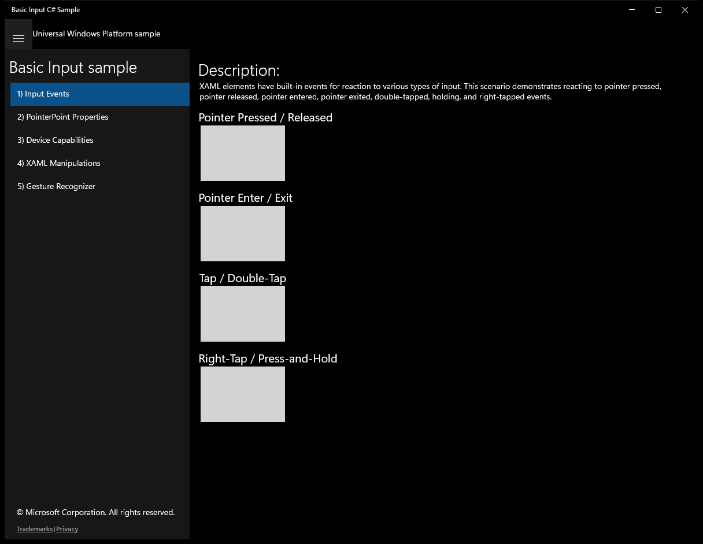
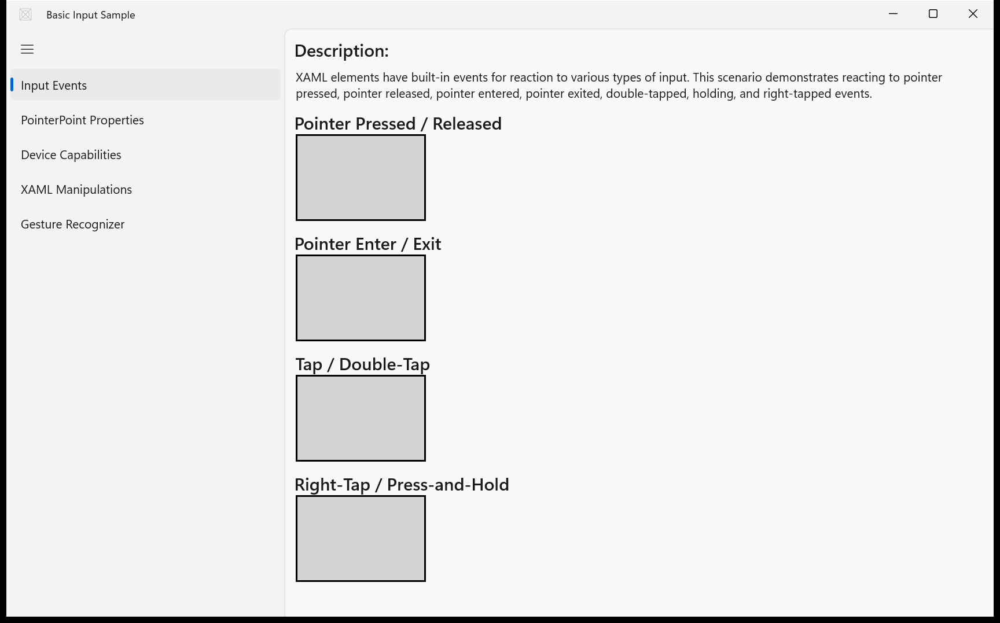

# BasicInput — WinUI 3 (migrated from UWP)

**Quality: 95 / 100**

| Project | UI fidelity | Visual fidelity | Functional fidelity |
|:-:|:-:|:-:|:-:|
| 9 / 10 | 9 / 10 | 8 / 10 | 9 / 10 |

Pointer, keyboard, and manipulation event routing across nested elements; gestures and tap targets.

## Run

```powershell
winapp run
```

## Before / after (main view)

UWP source (baseline) and the WinUI 3 migration of the same scenario:

| UWP source | WinUI 3 (this migration) |
|:-:|:-:|
|  |  |

## Source

- UWP source: `..\..\..\uwp-samples-standalone\Samples\BasicInput\cs\`
- Migrated by: Claude Opus 4.6 + the `winui-uwp-migration` skill (run16)
- Project file: `BasicInput\BasicInput.csproj`