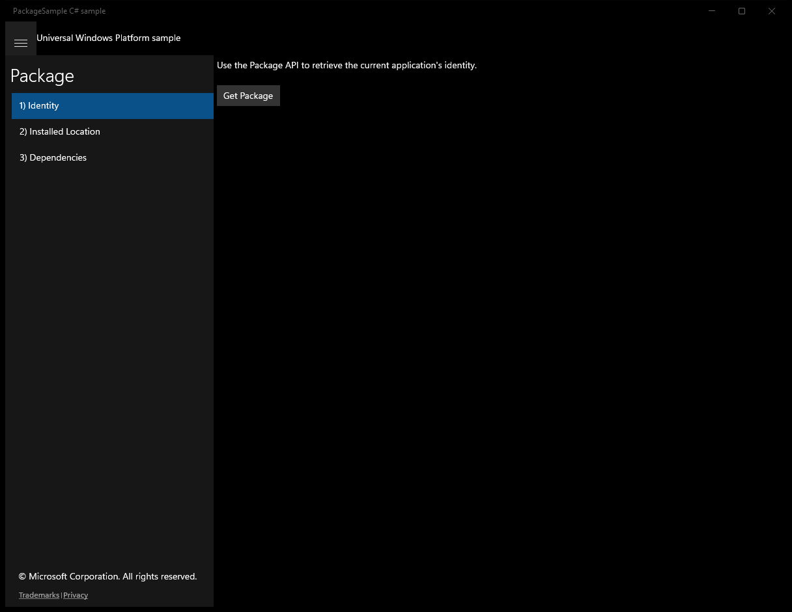
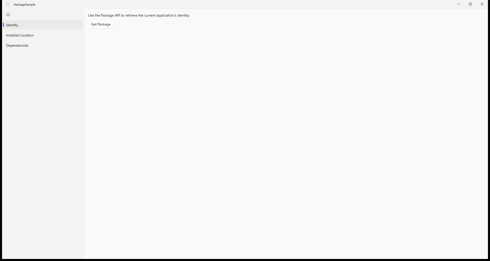
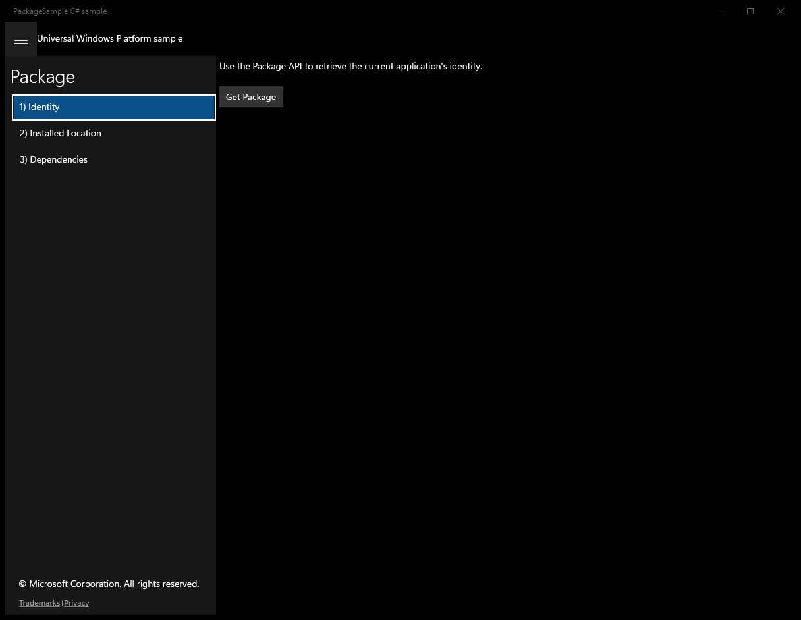
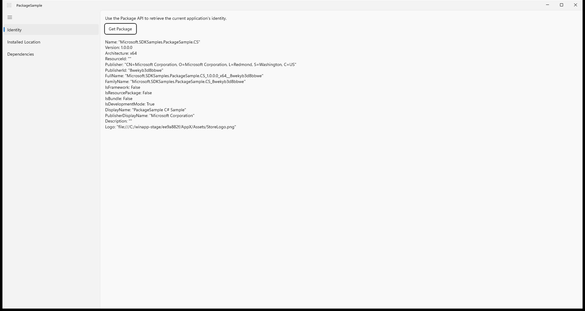
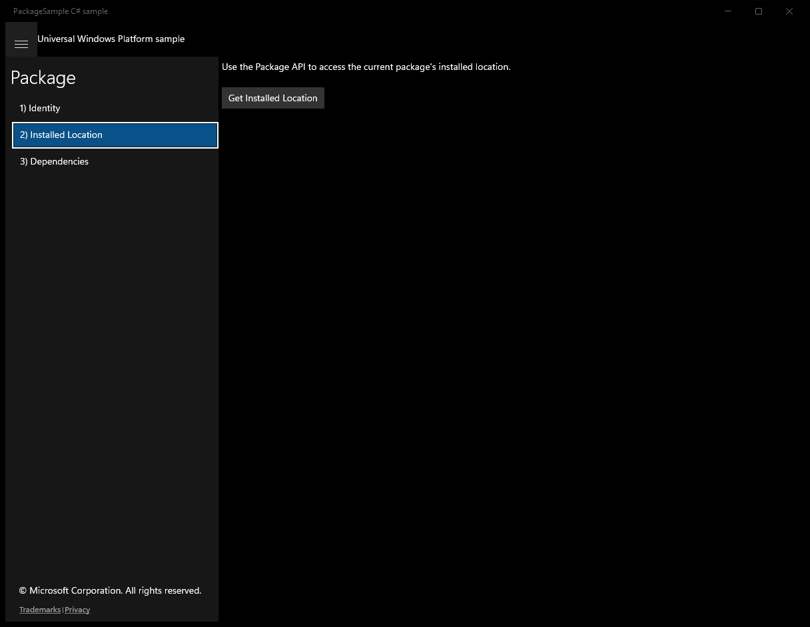
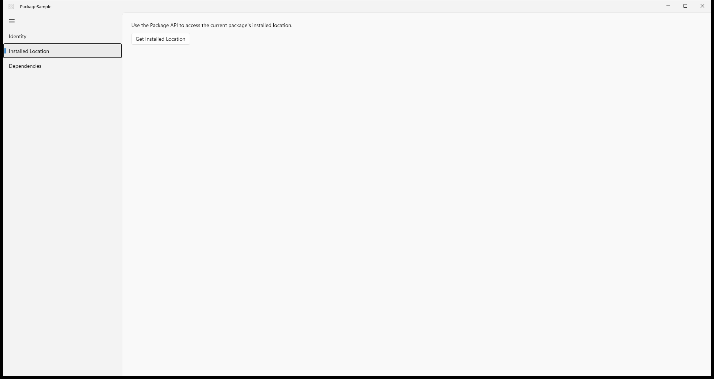
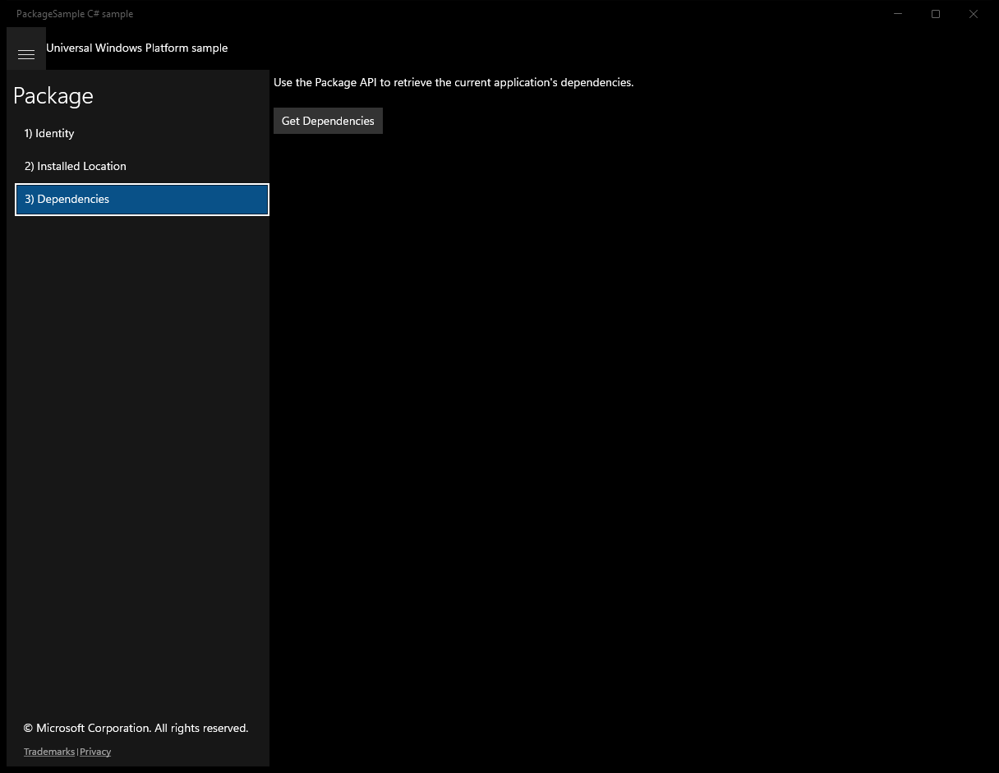
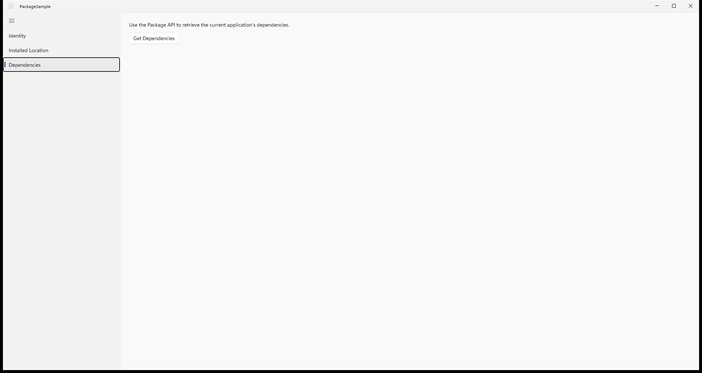

# Package — WinUI 3 (migrated from UWP)

**Quality: 96 / 100**

| Project | UI fidelity | Visual fidelity | Functional fidelity |
|:-:|:-:|:-:|:-:|
| 9 / 10 | 9 / 10 | 8 / 10 | 10 / 10 |

Read app package identity, version, dependencies, and signature info via
`Windows.ApplicationModel.Package`. Three scenario pages: Identity,
Installed Location, and Dependencies.

## Run

```powershell
winapp run
```

## Before / after (main view)

UWP source (baseline) and the WinUI 3 migration of the same scenario:

| UWP source | WinUI 3 (this migration) |
|:-:|:-:|
|  |  |

<!-- BEGIN per-scenario -->
## Per-scenario UWP -> WinUI 3 comparison

Initial state of each scenario page, original UWP sample on the left and the migrated WinUI 3 build on the right.

### Scenario 1 — identity

| UWP source | WinUI 3 (migrated) |
|:-:|:-:|
|  |  |

### Scenario 2 — installedlocation

| UWP source | WinUI 3 (migrated) |
|:-:|:-:|
|  |  |

### Scenario 3 — dependencies

| UWP source | WinUI 3 (migrated) |
|:-:|:-:|
|  |  |
<!-- END per-scenario -->

## Source

- UWP source: `..\..\..\uwp-samples-standalone\Samples\Package\cs\`
- Migrated by: Claude Opus 4.6 + the `winui-uwp-migration` skill (run9)
- Project file: `PackageSample\PackageSample.csproj`


