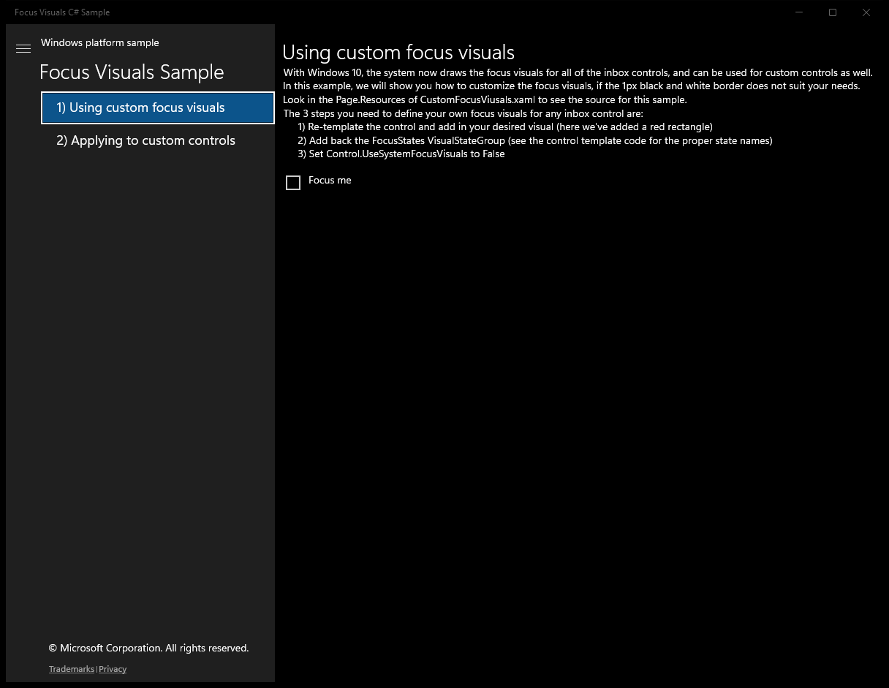
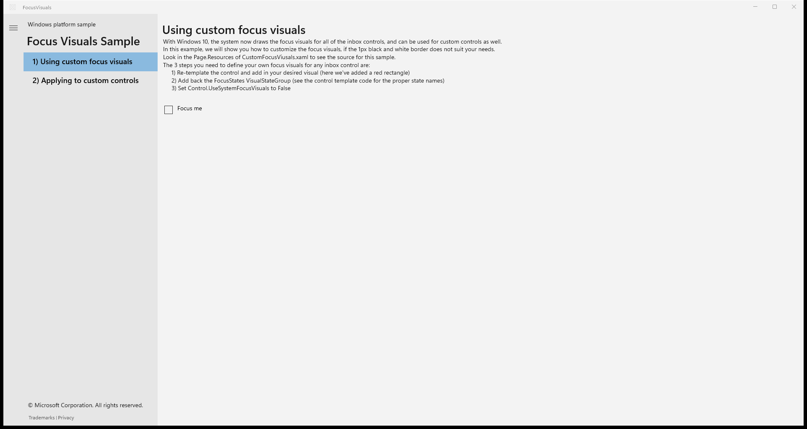
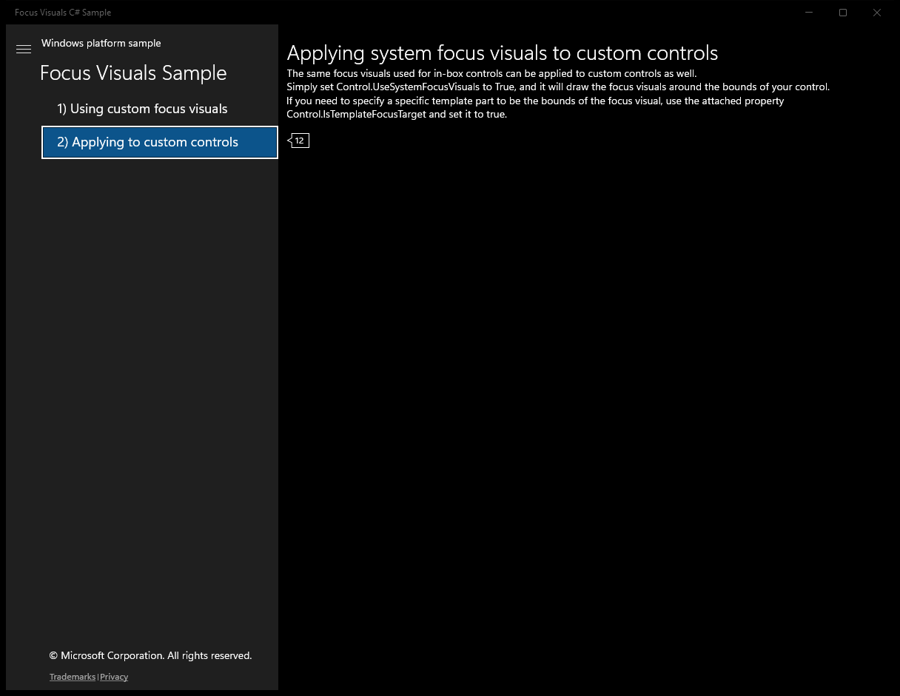
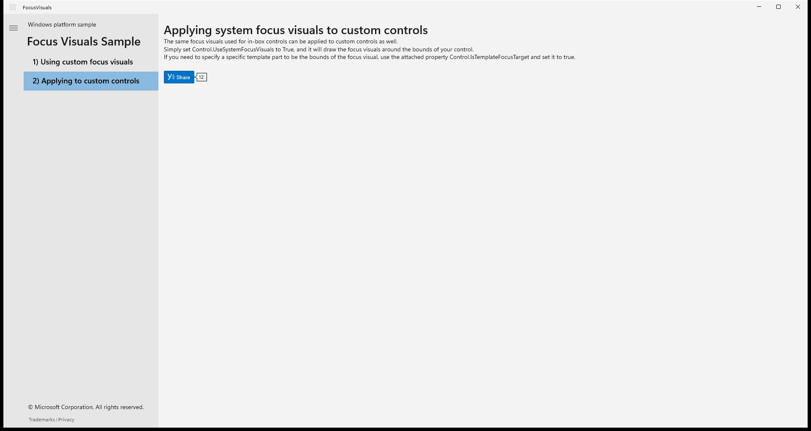

# XamlFocusVisuals — WinUI 3 (migrated from UWP)

**Quality: 93 / 100**

| Project | UI fidelity | Visual fidelity | Functional fidelity |
|:-:|:-:|:-:|:-:|
| 9 / 10 | 8 / 10 | 7 / 10 | 9 / 10 |

Keyboard-focus visual customization, system vs custom focus rectangles, reveal animations.

## Run

```powershell
cd FocusVisualsSample && winapp run
```

## Before / after (main view)

UWP source (baseline) and the WinUI 3 migration of the same scenario:

| UWP source | WinUI 3 (this migration) |
|:-:|:-:|
|  |  |

<!-- BEGIN per-scenario -->
## Per-scenario UWP -> WinUI 3 comparison

Initial state of each scenario page, original UWP sample on the left and the migrated WinUI 3 build on the right.

### Scenario 1 — Using custom focus visuals

| UWP source | WinUI 3 (migrated) |
|:-:|:-:|
|  |  |

### Scenario 2 — Applying to custom controls

| UWP source | WinUI 3 (migrated) |
|:-:|:-:|
|  |  |
<!-- END per-scenario -->

## Source

- UWP source: `..\..\..\uwp-samples-standalone\Samples\XamlFocusVisuals\cs\`
- Migrated by: Claude Opus 4.6 + the `winui-uwp-migration` skill
- Project file: `FocusVisualsSample\FocusVisualsSample.csproj`
